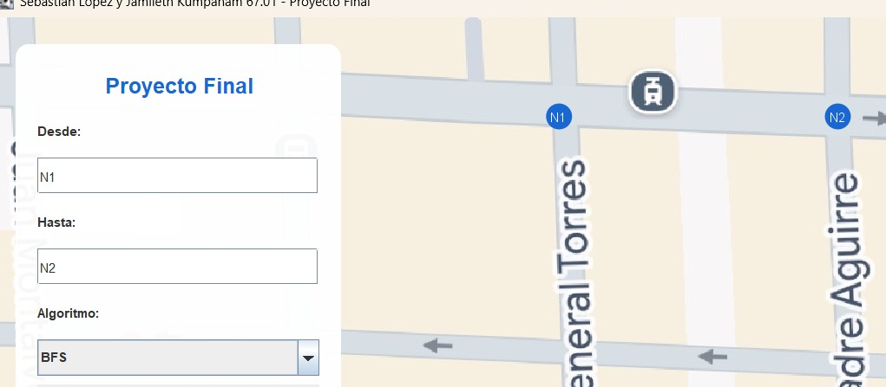
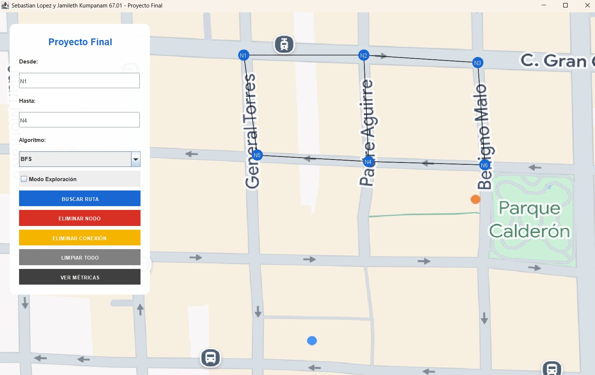
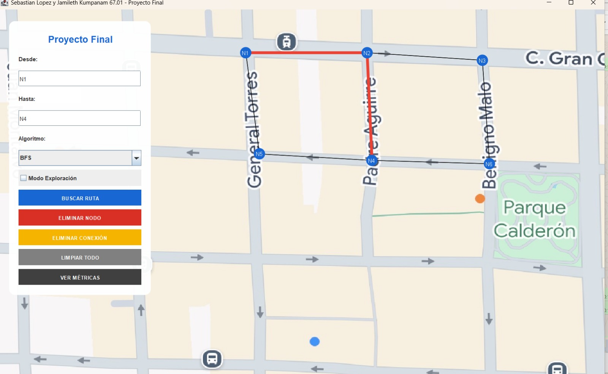
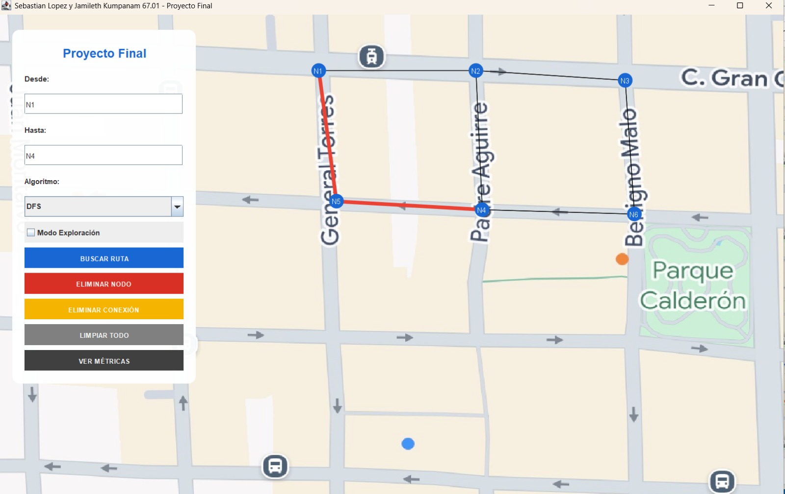
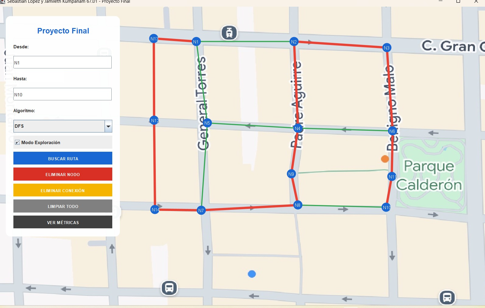

# Proyecto Final – Búsqueda de Rutas en un Laberinto usando BFS y DFS

## Asignatura
Estructura de Datos 

## Estudiantes
- Integrantes: Jamileth Kumpanam - Sebastián López 
- Carrera: Computación  
- Docente: Ing. Pablo Torres  

---

## Índice
1. Objetivo  
2. Descripción del problema  
3. Marco teórico  
4. Tecnologías utilizadas  
5. Arquitectura del proyecto (MVC)  
6. Estructura de carpetas  
7. Descripción del funcionamiento  
8. Persistencia de datos  
9. Algoritmos implementados  
10. Registro de tiempos de ejecución  
11. Capturas de la aplicación  
12. Comparación BFS vs DFS  
13. Conclusiones  
14. Recomendaciones  

---

## Objetivo
Desarrollar una aplicación en Java que modele un mapa de calles como un grafo, permitiendo encontrar y visualizar una ruta entre dos puntos utilizando los algoritmos **BFS (Breadth-First Search)** y **DFS (Depth-First Search)**, aplicando correctamente estructuras de datos y el patrón MVC.

---

## Descripción del Problema
El sistema representa un mapa mediante un grafo donde:
- Los **nodos** representan intersecciones.
- Las **aristas** representan calles entre intersecciones.
- Se define un nodo de inicio (A) y un nodo destino (B).

La aplicación permite ejecutar BFS y DFS y visualizar gráficamente el recorrido sobre el mapa, comparando el comportamiento de ambos algoritmos.

---

## Marco Teórico

### Grafos
Un grafo es una estructura compuesta por nodos y aristas que modela relaciones entre elementos. Es ideal para representar mapas de calles y rutas.

### BFS (Breadth-First Search)
Explora el grafo por niveles utilizando una **cola (Queue)**. Garantiza encontrar la ruta más corta en grafos no ponderados.

### DFS (Depth-First Search)
Explora el grafo en profundidad utilizando **recursividad o una pila (Stack)**. Su resultado depende del orden de exploración.

---

## Tecnologías Utilizadas
- Lenguaje: **Java**
- IDE: **Visual Studio Code**
- Interfaz gráfica: **Java AWT / Swing**
- Control de versiones: **Git y GitHub**
- Persistencia: Archivos `.txt` y `.csv`

---

## Arquitectura del Proyecto (MVC)

El proyecto sigue el patrón **Modelo – Vista – Controlador (MVC)**:

### Modelo (`models`)
- `Node.java`: Representa un nodo del grafo.
- `Edge.java`: Representa una conexión entre nodos.
- `Graph.java`: Contiene la estructura del grafo.
- `VisitedEdge.java`: Controla aristas visitadas.
- `SearchResult.java`: Almacena la ruta y resultados.

### Controlador (`controllers`)
- `GraphController.java`: Gestión del grafo y nodos.
- `SearchController.java`: Implementación de BFS y DFS.

### Vista (`views`)
- `MainFrame.java`: Ventana principal.
- `MapPanel.java`: Visualización del mapa, nodos y rutas.

### Utilidades (`utils`)
- `FileManager.java`: Lectura y escritura de archivos.
- `TimeLogger.java`: Registro de tiempos de ejecución.

---

## 📂 Estructura de Carpetas

icc-est-u3-proyectoFinalLaberinto/
│
├── src/
│ ├── App.java
│ ├── controllers/
│ ├── models/
│ ├── views/
│ ├── utils/
│ └── data/
│
├── data/
│ └── grafo.txt
│
├── config_grafo.txt
├── deleted_nodes.txt
├── execution_log.csv
├── screenshots/
├── README.md

---

## Descripción del Funcionamiento
1. La aplicación carga la imagen del mapa.
2. Se leen los nodos y conexiones desde archivos de configuración.
3. El usuario selecciona el nodo de inicio y el nodo destino.
4. Se ejecuta BFS o DFS desde la interfaz.
5. El recorrido se visualiza sobre el mapa.
6. Se reconstruye y muestra la ruta final encontrada.

---

## Persistencia de Datos
- `grafo.txt` / `config_grafo.txt`: Almacenan nodos, coordenadas y conexiones.
- `deleted_nodes.txt`: Registra nodos eliminados.
- `execution_log.csv`: Guarda los tiempos de ejecución de BFS y DFS.

Los datos se cargan automáticamente al iniciar la aplicación.

---

## Algoritmos Implementados

### BFS
Implementado en `SearchController.java`, utiliza:
- Cola (`Queue`)
- Conjunto de nodos visitados
- Reconstrucción de ruta mediante predecesores

### DFS
Implementado en `SearchController.java`, utiliza:
- Pila implícita (recursividad)
- Control de nodos visitados
- Exploración en profundidad

---

## Registro de Tiempos de Ejecución
Cada ejecución de BFS y DFS registra su tiempo en el archivo:

execution_log.csv

Esto permite comparar el rendimiento de ambos algoritmos.

---

## Capturas de la Aplicación

> Las capturas se encuentran en la carpeta `screenshots/`

### Interfaz Principal

### Selección de Nodos

### BFS – Modo Exploración

### BFS – Ruta Final

### DFS – Modo Exploración

### DFS – Ruta Final

---

## Comparación BFS vs DFS

| Característica | BFS | DFS |
|---------------|-----|-----|
| Tipo de recorrido | Por niveles | En profundidad |
| Ruta más corta | Sí | No siempre |
| Uso de memoria | Mayor | Menor |
| Orden de exploración | Controlado | Dependiente |

---

## Conclusiones
BFS resulta más adecuado cuando se requiere encontrar la ruta más corta, mientras que DFS permite explorar rápidamente rutas profundas. La visualización del recorrido facilita la comprensión del comportamiento interno de cada algoritmo.

---

## Recomendaciones
- Mejorar la interfaz gráfica.

---

## Entregables
- Repositorio público en GitHub  
- Código fuente completo  
- Archivo README.md  
- Ejecutable JAR  
- Video demostrativo en formato MP4  
